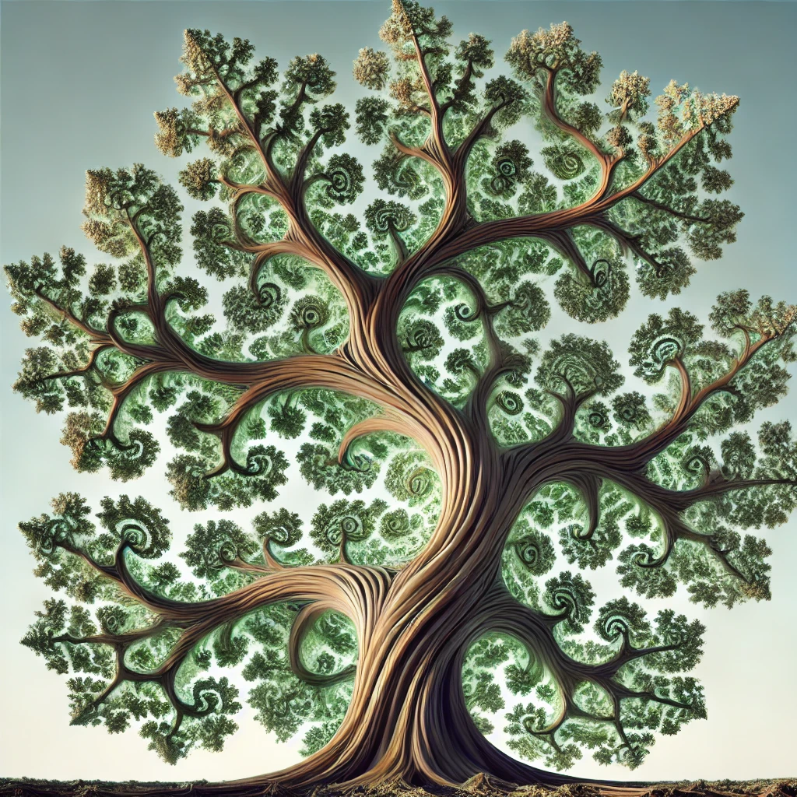

# Recursividad

<big>*Para entender la recursividad, primero hay que entender la recursividad.*</big>

- [Introducción](introduccion.md).
- [Recursividad vs iteración](recursividadVsIteracion.md).
- [El orden de los factores altera el producto](elOrden.md).
- [Backtracking](backtracking.md).
- [Análisis conceptual](analisisConceptual.md)

> [Algunos (pocos) ejemplos clásicos & reales...](vademecum.md).
